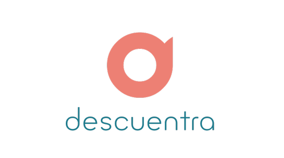

# Anteproyecto - Descuentra

## Indice

- [IDENTIFICACIÓN](#identificación) 

- [DESCRIPCIÓN DEL PROYECTO](#presentación-y-descripción-del-proyecto)

- [ARQUITECTURA Y LENGUAJES A UTILIZAR](#arquitectura-y-tecnologías-a-utilizar)

## Identificación.

DESCUENTRA

Proyecto para entornos de desarrollo en 1ºDAW.

Integrantes del grupo:
- Samuel González
- Jaime León 

## Presentación y descripción del proyecto.

El objetivo de este proyecto será empezar el desarrollo de un programa en forma de página web. Descuentra servirá de rastreador de descuentos y promociones para productos comprados en tiendas online externas.

En Descuentra se le mostrará al usuario una página principal con las mejores ofertas del momento, así como una serie de menús con todas las tiendas y marcas disponibles ordenadas por cantidad de descuentos y/u ofertas actuales de cada una de ellas. Una vez seleccionada una tienda, el usuario será llevado al sitio web correspondiente con la extensión Descuentra, la cual aplicará automáticamente todos los descuentos disponibles y mostrará el dinero ahorrado en la compra.

Esta pagina web, la cual necesitará de un registro y una asociación de tarjeta, almacenará en una base de datos cualquier tipo de descuento válido en una amplia selección de tiendas online e irá modificando la base de datos periodicamente almacenando y elminando descuentos según caduquen.

Descuentra se rentabilizará recibiendo un pequeño porcentaje del dinero descontado con cada compra a cambio del servicio, suficiente para que el usuario considere el uso de la aplicación rentable y use Descuentra con cada compra online.

## Arquitectura y tecnologías a utilizar.

### Back-end

Se utilizará Python para la programación de la aplicación, así como SQLite para la creación y administración de la base de datos de la misma.

### Front-end

La parte de la aplicación de cara al usuario se realizará utilizando HTML Y CSS.
