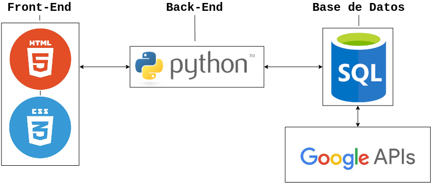

# Preliminary project: TableStars

## Index

- [IDENTIFICATION](#identification) 

- [PROJECT DESCRIPTION](#presentation-and-description-of-the-project)

- [ARQUITECTURE AND PROGRAMMING LANGUAGES](#arquitecture-and-programming-languages)

## Identification.

TABLESTARS

Project for the Development Environments subject of 1ºDAW, IES Puerto de la Cruz.

Group members:
- Samuel González
- Jaime León 

## Presentation and description of the project.

The goal of this project will be establishing the bases of a program, in this case in the form of an application. TableStars will be a platform to play classic tabletop games online and with a new layer of challenge.

We aim to create a tabletop gaming community that revolves around competition and betting, giving our players a selection of classic tabletop games and a wide range of tables both free and paid with different types and ammounts of bets.

TableStars will profit everytime a player buys tokens; the in-game currency that will be used for both betting and buying any kind of trinket or customization for our tables 

## Arquitecture and programming languages

We will be using Python for the back-end coding of the app and SQLite for creating and administrating the database of it.

The part of the app that will be shown to the user will be made with HTML5 and CSS.