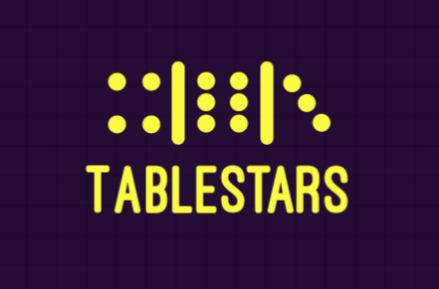
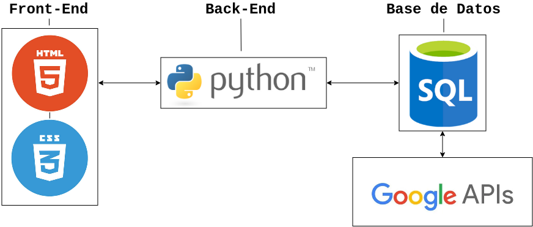

# Preliminary project: TableStars

## Index

- [Identification](#identification) 

- [Project description](#presentation-and-description-of-the-project)

- [Arquitecture and programming languages](#arquitecture-and-programming-languages)

## Identification.

TABLESTARS

Project for the Development Environments subject of 1ºDAW, IES Puerto de la Cruz.

Group members:
- Samuel González
- Jaime León 

## Presentation and description of the project.

The goal of this project will be establishing the bases of a program, in this case in the form of an application. TableStars will be a platform to play classic tabletop games online and with a new layer of challenge.

Our goal is to create a board game community that revolves around competition and betting, offering our players a selection of classic games and a wide range of both free and paid tables with different types and amounts of bets, as well as an in-game store where users will be able to exchange currencies and buy special skins and items.

There will be two main currencies in the game; virtual coins and diamonds:
    - The Virtual coin will be the less valuable one, as it will be easier to get just by playing and login in. This currency will be used to buy 'low tier' items or skins.   

    - Diamonds will be the premium currency of the game. They will be much harder to get by just playing, as players are intended to purchase them with real money and cash them back. Users will be able to exchange diamonds for virtual coins but not the other way around. Diamonds will be also used to buy premium or exclusive items.

Our first game to be implemented will be Parcheesi, which will have two table sizes: 4 players, 6 players. And it will have up to 4 tables of different betting levels, in its paid game modes.

Game modes are as follows:
- _Virtual Coin prize party_: In this mode the players can bet their virtual coins.
- _Diamond prize party_: In this mode players can bet their diamonds.
- _Guest party_: In this mode, available for both gusts and logged users, players will be able to play versus against random people for free.
- _Friends party_: In this mode you can play against your friends in the game, bets won't be allowed.

## Arquitecture and programming languages

We will be using Python for the back-end coding of the app and SQLite for creating and administrating the database of it.

The part of the app that will be shown to the user will be made with HTML5 and CSS.